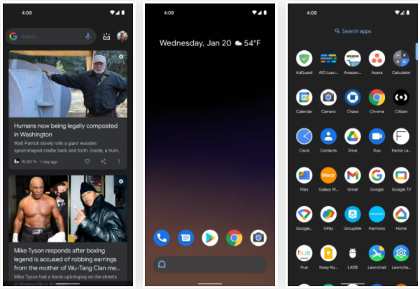
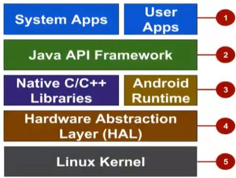

# **Application Development 02 Course 01 Notes**
## *Introduction to Application Development with Android*

> For tutorials on Android Studio app, you can visit https://developer.android.com

## What is Android?
[Skipped -- need notes to be posted (will update)]

## Android User Interaction
* Touch gestures (i.e.: swiping, tapping, pinching)
* Virtual keyboards
* Support for Bluetooth, USB controllers and peripherals

## Android and sensors
Sensors can discover user action and respond

* Device contents will rotate as needed
* Walking adjusts position on map
* Tilting steers a virtual car or controls a physical toy
* Moving too fast disables game interactions

## Android home screen
* Launcher icons for apps
* Self-updating widgets for live content
* Can be multiple pages
* Folders to organize apps
* "OK Google"

## Android Software Developper Kit (SDK)
* Development tools
    * debugger
    * monitors
    * editors
    * ...
* Libraries
    * maps
    * wearables
    * ...
* Virtual Devices
    * emulators
* Documentation
    * https://developers.android.com
* Sample Code

## Android Studio
Android Studio is the Official Android IDE. It is used to Develop, run, debug, test and package Android applications. 
It monitors and provides:

* Performance tools
* Virtual devices
* Project views
* Visual Layout Editor

## Google Play store
To publish an Android app, it needs to be done through Google Play store as it is the official app store for Android. The digital distribution service is operated by Google.

## ***Android Platform Architecture***
## Android Stack

1. System and user apps
2. Android OS API in Java Framework
3. Expose native APIs; run apps
4. Expose device hardware capabilities
5. Linux Kernel

    ### 1 - System and User Apps
        System apps have no special status and provide key capabilities to app developers, i.e.: an app may use a system app to deliver an SMS message.

    ### 2 - Java API Framwork
        The entire feature-set of the Android OS is available through APIs written in Java. It contains access to class hierarchy to create UI screens, a notification manager, activity manager for every application which manages life cycles and navigation, and many more.

    ### 3.1 - Android Runtime
        Each app runs in its own process with its own instance of the Android Runtime.

    ### 3.2 - c/c++ lIBRARIES
        Core C/C++ libraries give access to core native Android system components and services.
    
    ### 4 - Hardware Abstraction Layer (HAL)
        Standard interfaces that expose device hardware capabilities as libraries. I.e.: Camera, bluetooth model...
    
    ### 5 - Linux Kernel
        - Threading and low-level management
        - Security features
        - Drivers
    

## Older Android Versions

## ***App Development***

## What is an Android App?
An app that: 
* Has one or more interactive screens
* Every UI will be written using Java or XML languages
* Executed by Android Runtime Virtual machine (ART)
* Uses the Android Software Development Kit (SDK)
* Uses Android libraries and Android Application Framework

## Challenges of Android development
1. Multiple screen sizes and resolutions (different versions)
2. Performance: make your apps responsive and smooth -- must run fast + good aesthetics
3. Security: Keep source code and user data safe
4. Compability: run well on older platform versions
5. Marketing: Understand the market and your users -- variable prices

***[Incomplete for the moment]***