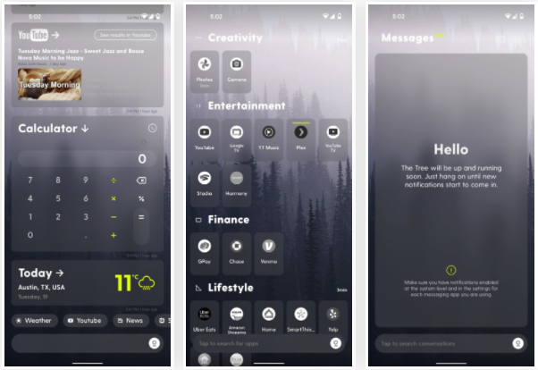

# **Chapter 01**
## *Introduction to Application Development with Android*

> For tutorials on Android Studio app, you can visit https://developer.android.com

## ***Android Ecosystem***
## What is Android?
Android is a mobile OS based on Linux kernel, making it open source, which offers UI for touch screens. It is used on over 80% of all smartphones and can power devices such as watches, Tvs and cars. Android offers offers over 2 million apps in the Google Play store and is highly customizable for devices by vendors.

## Android User Interaction
* Touch gestures (i.e.: swiping, tapping, pinching)
* Virtual keyboards
* Support for Bluetooth, USB controllers and peripherals

## Android and sensors
Sensors can discover user action and respond

* Device contents will rotate as needed
* Walking adjusts position on map
* Tilting steers a virtual car or controls a physical toy
* Moving too fast disables game interactions

## Android home screen
* Launcher icons for apps
* Self-updating widgets for live content
* Can be multiple pages
* Folders to organize apps
* "OK Google"
> https://android.gadgethacks.com/how-to/9-fresh-new-android-launchers-replace-your-boring-home-screen-2021-edition-0384249/

## Android Software Developper Kit (SDK)
* Development tools
    * debugger
    * monitors
    * editors
    * ...
* Libraries
    * maps
    * wearables
    * ...
* Virtual Devices
    * emulators
* Documentation
    * https://developers.android.com
* Sample Code

## Android Studio
Android Studio is the Official Android IDE. It is used to Develop, run, debug, test and package Android applications. 
It monitors and provides:

* Performance tools
* Virtual devices
* Project views
* Visual Layout Editor

## Google Play store
To publish an Android app, it needs to be done through Google Play store as it is the official app store for Android. The digital distribution service is operated by Google.

## ***Android Platform Architecture***
## Android Stack
> Diagram created by teacher   

1. System and user apps
2. Android OS API in Java Framework
3. Expose native APIs; run apps
4. Expose device hardware capabilities
5. Linux Kernel

    ### 1 - System and User Apps
        System apps have no special status and provide key capabilities to app developers, i.e.: an app may use a system app to deliver an SMS message.

    ### 2 - Java API Framwork
        The entire feature-set of the Android OS is available through APIs written in Java. It contains access to class hierarchy to create UI screens, a notification manager, activity manager for every application which manages life cycles and navigation, and many more.

    ### 3.1 - Android Runtime
        Each app runs in its own process with its own instance of the Android Runtime.

    ### 3.2 - c/c++ lIBRARIES
        Core C/C++ libraries give access to core native Android system components and services.
    
    ### 4 - Hardware Abstraction Layer (HAL)
        Standard interfaces that expose device hardware capabilities as libraries. I.e.: Camera, bluetooth model...
    
    ### 5 - Linux Kernel
        - Threading and low-level management
        - Security features
        - Drivers
    

## Older Android Versions
> https://stackoverflow.com/questions/8629687/android-api-level-vs-android-version

## ***App Development***

## What is an Android App?
An app that: 
* Has one or more interactive screens
* Every UI will be written using Java or XML languages
* Executed by Android Runtime Virtual machine (ART)
* Uses the Android Software Development Kit (SDK)
* Uses Android libraries and Android Application Framework

## Challenges of Android development
1. Multiple screen sizes and resolutions (different versions)
2. Performance: make your apps responsive and smooth -- must run fast + good aesthetics
3. Security: Keep source code and user data safe
4. Compability: run well on older platform versions
5. Marketing: Understand the market and your users -- variable prices

## App Building Blocks
* Resources
    * Layouts
    * Images
    * Strings
    * Colours as XML and media files
* Components
    * Activities
    * Services
    * Helper classes as Java code
* Manifest -- Information about apps for the runtime
* Build configuration -- APK versions in Gradle config files

# Chapter 02
## *Your First Android App*
> This chapter is dedicated to creating basic applications with Android Studio and running apps on virtual and physical machines. Prerequisites include Java programming Languages, OOP, XML and using IDE.

## ***Android Studio***
## What is Android Studio?
Android studio is an intrated development environment (IDE) that offers templates for projects and activities, a layout editor, testing tools, gradle-based build, log console and debugger as well as Android device emulators.

## Android Studio Interface
> Diagram by teacher

1. Toolbar
    * Carries out a wide range of actions i.e.: running app, launching tools, etc.
2. Navigation bar
    * Helps navigate through projects
    * Open files for editing
    * Provides compact view of structure
3. Project panes
    * Allows you to navigate through the hierarchy of your projects folders
4. Editor
    * Where you create and modify code
    * Allows you to view and edit your project
    * Includes the windows for the palette and layout editor as well as code editor
5. Tabs for other panes

## *Creating your first Android app

