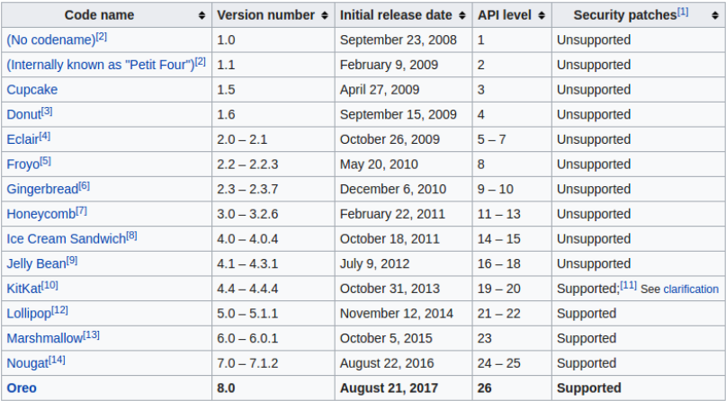

# **Chapter 01**
## *Introduction to Application Development with Android*

> For tutorials on Android Studio app, you can visit https://developer.android.com

## ***Android Ecosystem***
## What is Android?
Android is a mobile OS based on Linux kernel, making it open source, which offers UI for touch screens. It is used on over 80% of all smartphones and can power devices such as watches, Tvs and cars. Android offers offers over 2 million apps in the Google Play store and is highly customizable for devices by vendors.

## Android User Interaction
* Touch gestures (i.e.: swiping, tapping, pinching)
* Virtual keyboards
* Support for Bluetooth, USB controllers and peripherals

## Android and sensors
Sensors can discover user action and respond

* Device contents will rotate as needed
* Walking adjusts position on map
* Tilting steers a virtual car or controls a physical toy
* Moving too fast disables game interactions

## Android home screen
* Launcher icons for apps
* Self-updating widgets for live content
* Can be multiple pages
* Folders to organize apps
* "OK Google"
> https://android.gadgethacks.com/how-to/9-fresh-new-android-launchers-replace-your-boring-home-screen-2021-edition-0384249/


## Android Software Developper Kit (SDK)
* Development tools
    * debugger
    * monitors
    * editors
    * ...
* Libraries
    * maps
    * wearables
    * ...
* Virtual Devices
    * emulators
* Documentation
    * https://developers.android.com
* Sample Code


## Android Studio
Android Studio is the Official Android IDE. It is used to Develop, run, debug, test and package Android applications. 
It monitors and provides:

* Performance tools
* Virtual devices
* Project views
* Visual Layout Editor


## Google Play store
To publish an Android app, it needs to be done through Google Play store as it is the official app store for Android. The digital distribution service is operated by Google.

## ***Android Platform Architecture***
## Android Stack
> Diagram created by teacher   

1. System and user apps
2. Android OS API in Java Framework
3. Expose native APIs; run apps
4. Expose device hardware capabilities
5. Linux Kernel

    ### 1 - System and User Apps
        System apps have no special status and provide key capabilities to app developers, i.e.: an app may use a system app to deliver an SMS message.

    ### 2 - Java API Framwork
        The entire feature-set of the Android OS is available through APIs written in Java. It contains access to class hierarchy to create UI screens, a notification manager, activity manager for every application which manages life cycles and navigation, and many more.

    ### 3.1 - Android Runtime
        Each app runs in its own process with its own instance of the Android Runtime.

    ### 3.2 - c/c++ lIBRARIES
        Core C/C++ libraries give access to core native Android system components and services.
    
    ### 4 - Hardware Abstraction Layer (HAL)
        Standard interfaces that expose device hardware capabilities as libraries. I.e.: Camera, bluetooth model...
    
    ### 5 - Linux Kernel
        - Threading and low-level management
        - Security features
        - Drivers
    

## Older Android Versions
> https://stackoverflow.com/questions/8629687/android-api-level-vs-android-version


## ***App Development***

## What is an Android App?
An app that: 
* Has one or more interactive screens
* Every UI will be written using Java or XML languages
* Executed by Android Runtime Virtual machine (ART)
* Uses the Android Software Development Kit (SDK)
* Uses Android libraries and Android Application Framework

## Challenges of Android development
1. Multiple screen sizes and resolutions (different versions)
2. Performance: make your apps responsive and smooth -- must run fast + good aesthetics
3. Security: Keep source code and user data safe
4. Compability: run well on older platform versions
5. Marketing: Understand the market and your users -- variable prices

## App Building Blocks
* Resources
    * Layouts
    * Images
    * Strings
    * Colours as XML and media files
* Components
    * Activities
    * Services
    * Helper classes as Java code
* Manifest -- Information about apps for the runtime
* Build configuration -- APK versions in Gradle config files

# Chapter 02
## *Your First Android App*
> This chapter is dedicated to creating basic applications with Android Studio and running apps on virtual and physical machines. Prerequisites include Java programming Languages, OOP, XML and using IDE.

## ***Android Studio***
## What is Android Studio?
Android studio is an intrated development environment (IDE) that offers templates for projects and activities, a layout editor, testing tools, gradle-based build, log console and debugger as well as Android device emulators.

## Android Studio Interface
> Diagram by teacher


1. Toolbar
    * Carries out a wide range of actions i.e.: running app, launching tools, etc.
2. Navigation bar
    * Helps navigate through projects
    * Open files for editing
    * Provides compact view of structure
3. Project panes
    * Allows you to navigate through the hierarchy of your projects folders
4. Editor
    * Where you create and modify code
    * Allows you to view and edit your project
    * Includes the windows for the palette and layout editor as well as code editor
5. Tabs for other panes

> Diagram by teacher


1. XML Layout file
    * Used to define the actual UI
    * Holds all the elements(views) or the tools used in the application
2. Design and Text tabs
3. Palette pane
    * Contains various different views
    * Can drag its contents directly onto the Design pane
4. Component Tree
    * Shows the hierarchy of components in your layout
5. Design and Blueprint panes
    * Left is design -- Right is blueprint
    * Portrays a simplified, outlined view of the UI
6. Attributes tab
    * Margin controls for positioning
    * Attributes such as layout_width and layout_height
    

## *Creating your first Android app*
> 1. Start Android Studio
> 2. Create a project inside Android Studio
> 3. Name your app
> 4. Pick an activity template (we will mostly use 'Basic Activity' or 'Empty Activity')
> 5. Name your activity
> 6. Run your app

## Naming your Activity
The good practice beind naming your activity goes as follows:
* Activity name: MainActivity
* Layout name: activity_main

In this step you also ensure that both the 'Generate Layout File' and 'AppCompat' checkboxes are checked.

## Project folders
> Diagram by teacher  

1. Android Manifest file
    * Description of the app read by the Android runtime
2. Java source code packages
3. Resources (XML)
    * Layout
    * Strings
    * Images
    * Dimensions
    * Colours
    * etc
4. Gradle build files

## Gradle Build System
The Gradle build system is a modern build subsystem in Android studio. It has three build.gradle subsections:
1. project
2. module
3. settings

## Running your app on a physical device
1. Turn on Developer Options on your phone
    * Settings > about Phone
    * Build number x 7
2. Turn on USB Debugging
    * Settings > Developper Options > USB Debugging
3. Connect phone to computer with cable

## Adding Logging to your App
The Logcat pane shows information as the app runs. You can selt filters in it to see what's important to you

Logging statements:
```java
// Use class name as tag
MainActivity.class.getSimpleName();

// Show message in Android Monitor, logcat pane 
// log.<Log-level>(TAG, "Message");
Log.d(TAG, "Creating the URI...");
```

# Chapter 03
## *Layouts and Resources for the UI*

> This chapter discusses Views, view groups and view hierarchy, the layout editor and *ConstraintLayout*, Event handling as well as Resources and Measurements

## ***Views***
## What is a view?
Everything you see is a view

In reality, a view is a subclass that is a basic UI building block
* Display text (TextView class), edit text (EditText class)
* Buttons (Buttons class), menus, other controls
* Scrollable (ScrollView, RecyclerView)
* Show images (ImageView)
* Group views (ConstraintLayout and LinearLayout)

Below are examples of view subclasses:


## View Attributes
Views usually have colour, dimentions and a position. They may have a focus, such as recceiving user inpit and may be interactive. An example of interactivity is that a view could respond to a user click. A view is usually, but not necessarily, visible and tends to have relationships with other views.

## View Defined in XML
```XML
<TextView
    android:id="@+id/show_count"
    android:layout_width="match_parent"
    android:layout_height="wrap_content"
    android:background="@color/myBackgroundColor"
    android:text="@string/count_initial_value"
    android:textColor="@color/colorPrimary"
    android:textSize="@dimen/count_text_size"
    android:textStyle="bold" 
/>
```

## What is the Context? 
Context is an interface to global information about an application environment.
* You can get the context
* An activity can be its own context

## Custom Views
* Over 100 different types of views
* Creat custom views by subclassing existing views or the View class

## ***ViewGroup and View hierarchy***
## Viewgroups and "child" views
* ConstraintLayout:
    * Positions UI elements using constraint connections
    * Constraint connections to other elements and layout edges
* ScrollView: 
    * Contains one element
    * Enables scrolling
* RecyclerView
    * Contains a list of elements
    * Enables scrolling by adding and removing elements dynamically

## ViewGroups for Layouts
Layouts are specigic types of ViewGroups: they are a subclass.
* They contain child views
* Can be in a row, column, grid, table, absolute

## Common Layout Classes
> Diagram by teacher


1. LinearLayout = Horizontal or vertical row 
    * Creates scrollbar if legth of window > length of screen
2. ConstraintLayout = Connects views with constraints
3. GridLayout = Scrolling grid of rows and columns
4. TableLayout = arranged groups of views into rows and columns
5. RelativeLayout = Enables to specify location of child layout in relation to each other
6. FrameLayout: Shows one child of a stack of children

## Class hierarchy vs. Layout hierarchy
| Class Hierarchy | Layout Hierarchy |
|-----------------|------------------|
| Standard object-oriented class inheritance | How views are visually arranged|
|Superclass-subclass relationship | Parent-child relationship|

## Hierarchy of ViewGroups and Views
>https://www.researchgate.net/publication/342510190_Enhancing_Automated_GUI_Exploration_Techniques_for_Android_Mobile_Applications/figures?lo=1&utm_source=google&utm_medium=organic


## View Hierarchy and Screen Layout
> Diagram by teacher


## View Hieararchy in the Layout editor
> Diagram by teacher


## Best Practices for View Hierarchies
The arrangements of view hierarchies affects app performance. To ensure better performance:
* Use smallest number of simplest views possible
* Keep hierarchy flat by limiting nesting of views and view groups

## ***The layout Editor and Constraint Layout***
## What is ConstraintLayout?
ConstraintLayout is the default layout for a new Android Studio project. It is a ViewGroup that offers flexibility for layout design and t provides constraints to determine positions and alignment of UI elements. In this context, constraint is a connection to another view, parent layout or invisible guideline.

## The layout Editor with ConstraintLayout
* Connects UI elements to parent layout
* Resize and position elements
* Align elements to others
* Adjust margins and dimensions
* Change attributes

## Layout Editor Main Toolbar
> Diagram by teacher


1. Select Design Surface: Design and Blueprint panes
2. Orientation in Editor: Portrait and Landscape
3. Device in Editor: Choose device for preview
4. API Version in Editor: Choose API for preview
5. Theme in Editor: Choose theme for preview 
6. Locale in Editor: Choose language/locale for preview

## ConstraintLayout toolbar in layout editor
> Diagram by teacher


1. Show: Show Constraints and Show Margins
2. Autoconnect: Enable or disable
3. Clear All Constraints: Clear all constraints in layout
4. Infer Constraints: Create constraints by inference
5. Default Margins: Set default margins
6. Pack: Pack or expand selected elements
7. Align: Align selected elements
8. Guidelines: Add vertical or horizontal guidelines
9. Zoom controls: Zoom in or out

### 2. Autoconnect
Generates constraints against parent layout when enabled

## ConstraintLayout handles
> Diagram by teacher


1. Resizing handle
2. Constraint line and handle
3. Constraint handle
4. Baseline handle

## Align elements by baseline
1. Click the baseline constraint button
2. Drag from one element's baseline to another's

## ***Event Handling***
## Events
Something that happens
* In UI: 
    * Click
    * Tap
    * Drag
* Device:
    * DetectedActivity such as walking, driving, tilting
* Events are "noticed" by the Android system

## Event Handlers
A method is triggered by a spacific event and does something in response to that event.

## ***Resources and Measurements***
## Resources
* Separate static data from code in your layouts.
* Strings, dimensions, images, menu text, colors, styles
* Useful for localization
* Stored in **res** folder

## Measurements
DO NOT use device-dependent or density dependent units such as Pixels(px) or measurements(in, mm, cm, etc).
Use:
* Density-independent Pixels (dp) for Views
* Scale-independent Pixels (sp) for text