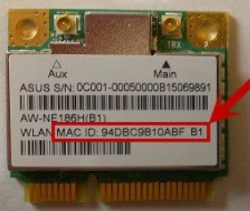
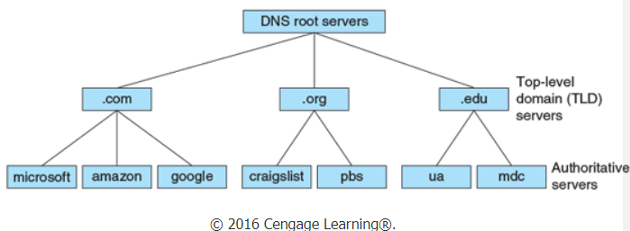
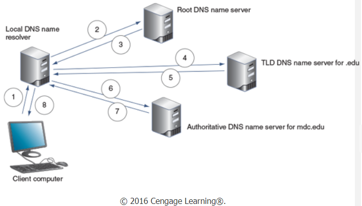
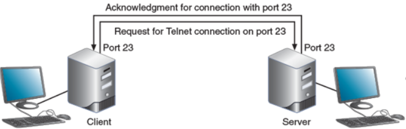
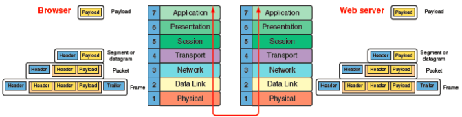
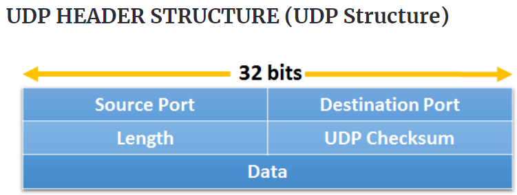

# **Chapter 01**
## *An Introduction to Networking*

> The resources a network makes available to its users include applications and the data provided by these applications. Collectively, these resources are usually referred to as network services. A network is a group of computers and other devices connected by some type of transmission media.

 

## How Networks are used
* Client-server Applications || Client computer requests data or a service from a second computer (the server).
    * Web services || A web browser (client computer) requests data or services; the Web serber (server app) returns a the requested data.
    * Email Services || SMTP (Simple Mail Transfer Protocol) sends an email to the sender's mail server, which sends it to  the receiver's mail server which intern uses POP3(Post Office Protocol) or IMAP4 (Internet Message Access Protocol) to allow the receiver to receive the email.
    * FTP (File Transfer Protocol) || Transfer files between two computers using FTP or SFTP (Secure File Transfer Protocol)
    * Telnet service || Command-line used to control a computer remotely (not secure)
    * Remote desktop || Secure transmission who both use RDP to establish a client-server communication
    * Remote applications || Aplication installed on a server - easy for maintenance and backup of applications
  
* File and Print Services
    * File services || server's ability to share files and disk storage space
    * File server || computer that provides files > one central location for data is more secure than relying on each individual to make backups
    * Print Services || share printers across a network
        * one printer = less time on maintenance and management

* Communications Services
    * Convergance || using the same network to deliver multiple types of communication services - i.e.: videos, voice messages, fax, etc
    * Unified communication (UC) || centralized management of multiple network-based communications

    * Types of communication services:
        * Conversational voice VoIP (Voice over IP) || Can use point-to-point model (Example: Skype) or point-to-multipoint model (Example: Conferance call)
        * Streaming live audio and video (Example: Skype)
        * Streaming stored audio and video (Example: Youtube)

   * Voice and video transmissions are delay-sensitive, they are considered loss-tolerent. 
   * Bandwith = amount of traffic, data, or transmission activity on the network

 

## Controlling Network Access
* Topology || how parts of a whole work together
* Physical topology || hardware -- how computers, cables and other devices form the physical network
* Logical topology || software -- [missing description]
* Network operating system || controlls access to the entire network

 

## Peer-to-Peer (or point-to-point) Model
The OS of each computer on the network is responsible for controlling access to its resources - no centralized connection. Each computer has its own local account that is not accessible by others. No computer has more authority than another; each computer controls its own resources, and communicates directly with other computers

Computers (hosts) can share resources or prevent accessto resources.

* Advantages:
    * Simple configuration
    * Less expensive
* Disadvantages
    * Not scalable
    * Not necessarily secure
    * Not practical for large installations

 

## Client-Server Network Model
Resources are managed by the Network Operating System (NOS) through a centralized database. A Windows domain uses the client-server model to control access to the network, where security on each computer or device is controlled by a centralized database on a domain controller

Terminology and definitions:

    > Windows Domain: Logical group of computers that a Windows Server can control.
    > Active Directory (AD): Centralized directory database that contains user account info and security for the entire group of computers.
    > Global Account (username or ID): domain-level account assigned by the network administrator and kept in AD. 

A user can sign onto the network from any computer on the network and gain access to the resources that AD allows.

Clients don't share their resources directly to each other - its controlled by entries in the domain database.

The NOS is responsible for:
* Managing client data and resources
* Ensuring authorized user access
* Controlling user file access
* Restricting user network access
* Dictating computer communication rules
* Supplying application to clients

Servers that have NOS installed require more memory, storage capacity and processing power and they should be equipped with special hardware that provides network management functions.

    Advantages in relation to P2P
        > User credentials assigned from one place
        > Multiple shared resource access centrally controlled
        > Centrol problem monitoring, diagnostics and correction capabilities
        > More scalable
    
    Disadvantages in relation to P2P
        > Complex in design
        > Harder to maintain

 

## LAN and Their Hardware
A network is a LAN (Locan Area Network) because each node on the network can communicate directly with others on the network. This type of network is usually contained in a small space. 

It needs a switch which receives incoming data from ports and redirects it to another or multiple other ports. It can have many switches by using a backbone which is a conduit that connects the segments of a network.

It uses Star Topology (all devides are connected to one device - the switch) and uses a NIC (Network Interface Card) which is a network port used to attach a device to a network.

The router is a device that manages the traffic between multiple networks. It can be used in small home networks to connect the LAN to the internet. Intustrial grade routers can have several network ports - one for each network it connects to. It is the gateway between networks. These switches are in line and are connected through a bus topology, making the entire network a star-bus topology.

A host is any computer on a network that hosts a resource such as an application or data, and a node is any computer or device on a network that can be addressed on the local network. A client computer or server is both a node and a host, but a router or switch does not normally host resources and is, therefore, merely a node on the network.

> The ring topology, which is no longer used today, is where nodes are connected in a ring form: one node may only connect to two neighbour nodes. Any node may put data on the ring only when it holds a token, which is a group of bits which passes through the ring. It is no longer used because it is slow.

 

## MANs and WANs
Metropolitan Area Network (MAN) is a group of connected LANs in the same geographical area - also known as Campus area network (aka CAN).

Wide Area Network (WAN) is a group of LANs spread over a wide geographical area.

Personal Area Network (PAN) is the smallest network and is used for personal devices.

 

## HVAC Systems
HVAC systems include heating, bentilation and air conditioning sustems. They control the environment in a data center. The environment includes temperature, humidity, airfloww and filtering. This type of system must provide acceptable temperature and humidity ranges for devices that might overheat or fail due to high temps and humidity.

    These systems usually occupy the space above the ceiling or below the floor in a data center.

 

## Protection Against Static Electricity
Electrostatic discharge (ESD) can damage electronic components that are grounded within a computer case. This damage can result in:

* Catastrophic failure || a component is destroyed beyond use
* Upset failure || the component's life span is shortened OR cause intermittent errors

To avoid ESD:
* Ground yourself by wearing an ESD strap or touching the case before touching its interior components
* Shut down and unplug a computer befre working inside it

 

## Troubleshooting Network Problems
Troubleshooting steps:
1. Identify the problem
    * Gather information
    * Identify the symptoms
    * Question users
    * Determine if anything has changed
2. Establish a theory of probable cause
    * Question the obvious
3. Test the theory to determine the cause
    * If theory confirmed -- Determine the next steps
    * If theory not confirmed -- Establish new theory or escalate
4. Establish an action plan
5. Implement a solution or escalate the problem
6. Verify full functionality
    * Implement preventive measures
7. Document findings, actions and outcomes

> http://bucarotechelp.com/networking/support/82042501.asp

 

## The seven-layer OSI model
The Open Systems Interconnection (OSI) reference model is a seven-layer model developed to categorize the layers of communication. It was first developed by the International Organization for Standardization, also called the ISO. The OSI model helps understand networking protocols and troubleshoot network problems.

The layers from bottom to top are layered 1 through 7:
1. Physical Layer
    * Sends bits via a wired or wireless transmission
        * Transmitted as wavelengths in the air
2. Data Link Layer (or Link Layer)
    * Examples of Link layer protocols are Ethernet and Wi-Fi. 
        * Ethernet works on wired networks
        * Wi-Fi is wireless
    * Puts its own control information in a Link layer header and also attaches control information to the end of the packet in a trailer
    * The frame header contains the hardware addresses of the source and destination NICs
        * MAC (Media Access Control)
        * Physical address
        * Hardware address
        * Data Link layer address
            * Address is embedded on every network adapter on the globe
3. Network Layer
    * Responsible for moving messages from one node to another until they reach the destination host
    * Principal protocol used by the Network layer is IP (Internet Protocol)
    * Adds its own Network layer header to the segment or datagram
    * Entire Network layer message is now called a packet
    * Network layer header identifies the sending and receiving hosts by their IP addresses
        * IP address is an address assigned to each node on a network -- it is unique
    * Routing protocols
        * ICMP (Internet Control Message Protocol)
        * ARP (Address Resolution Protocol)
4. Transport Layer
    * TCP (Transmission Control Protocol) — Makes a connection with the end host, checks whether the data is received, and resends it if it is not.
        * Connection-oriented protocol
        * Used for applications such as email
        * Divides data into smaller messages called segments
    * UDP (User Datagram Protocol) — Does not guarantee delivery by first connecting and checking whether data is received. 
        * Connectionless protocol // best-effort protocol
        * Used for services such as streaming and broadcasting
        * Message is called a datagram
    * The protocols add their own control information in an area at the beginning of the payload (data) called the header
    * Process of adding header to data = encapsulation
    * Removing a header and trailer from a layer below = decapsulation
5. Session Layer
    * Describes how data between applications is synced and recovered
6. Presentaition Layer
    * Responsible for reformatting, compressing, and/or encrypting data in a way that the application on the receiving end can read
7. Application Layer
    * Provide services to a user
    * Utility programs that provide services to the system

> https://www.imperva.com/learn/application-security/osi-model/

>https://www.bmc.com/blogs/osi-model-7-layers/  

Layers 2 and 1 are responsible for interfacing with the physical hardware only on the local network. The protocols at these layers are programmed into the firmware of a computer’s NIC and other networking hardware. The top layers of the OSI model work the same for both wired and wireless transmissions. The only layers that must deal with the details of wired versus wireless transmissions are the Link layer and Physical layer on the firmware of the NIC. 

The Application, Presentation, and Session layers are so intertwined that, in practice, it’s often difficult to distinguish between them. Also, tasks for each layer may be performed by the operating system or the application. Most tasks are performed by the OS when an application makes an API call to the OS.

> Cengage Learning -- **How All The Layers Work Together**

 

## Protocol Data Unit (PDU)
The PDU is a group of bits that moves from one layer of the OSI model to the next or from one LAN to the next.

> Cengage Learning - **Names for a PDU or Message as It Moves from One Layer to Another**

   

# Chapter 02
## *How Computers Find Each Other on Networks*
>This chapter addresses how computers and other devices are addressed on a network, explains how host names and domain names work, identifies how ports and sockets work at the OSI Transport layer, demonstrates how IP addresses are assigned and formatted at the OSI Network layer and teaches how to use command-line tools to troubleshoot problems with network addresses.

 

## An OverView of Addressing on Networks
There are four addressing methods: 
1. Application layer FQDNs, computer name and host name
2. Transport layer port numbers
3. Network layer IP address
4. Data link layer MAC address

 

### **1. Application layer FQDNs, computer name and host name**
Every host on a network is assigned a unique character-based name called the fully qualified host name or the fully qualified domain name (FQDN). I.e.: www.company.com.
* The two last parts are called the domain name - it matches the organization's domain or network
* First part is the host name

### **2. Port Numbers**
The port number identifies one application among several that might be running on a host.

### **3. IP address**
It is assigned to every interface (network connection made by a node or host). It is used to find hosts on any computer in the world.
* IPv4 - Internet Protocol version 4
    * 32 bits
    * 4 decimal numbers called octets
* IPv4 - Internet Protocol version 6
    * 128 bits
    * 8 blocks of hexadecimal numbers

### **4. MAC address**
The MAC address  is also known as the physical address. It's embedded on each NIC and is unique. Nodes on a LAN will find each other using the MAC address 
> https://silicophilic.com/change-mac-address-in-windows/ 

The traditional mac address contains two parts:
* First 24 bits
    * Known as OUI (organizationally unique identifier) or block ID or or company ID
    * Identifies the NIC's manufacturer
    * Assigned by the Institute of Electrical and Electronics Engineers (IEEE)
* Last 24 bits
    * Known as extension identifier or device ID
    * Identifies the device
    * Is based on the NIC's model and manufacture date

 

## How Host Names and Domain Names Work
Host and domain names were created because they are easier to remember than numeric IP addresses. They can include letters, hyphens and underscores - no other special characters are allowed. Domain names must be registered with an Internet ing company that works on behalf of ICANN.

 

### **DNS (Domain Name System *or* Domain Name Service)**
DNS was created to associate computer names to IP addresses and is an application layer client-server system of computers and databases made up of:
1. Namespace
    * The entire collection on computer names and associated IP addresses stored in databases on DNS name servers
2. Name servers
    * Hold database
    * Organized in hierarchical structure
3. Resolvers
    * DNS client that requests information from DNS name servers 

### **How Name Servers are Organized**
Root servers hold TDL servers (top-level domain) > TDL servers hold information about the authorative servers
> Cengage Learning    

How the resolution process gets more complex:
* Local name server is not an authoratice one
    * Exists only to resolve name for clients
    * Called a caching-only server
    * Queries the company's authoritative name server when it's requested for information that is not stored in DNS cache
* Name server doesn't have access to root server
* TDL name server might be aware of an intremediate name server rather than the authorative name server
    * When the intermediate server is queried it might return the IP address of the authorative name server

### **Recursive and Iterative Queries**
| Recursive Querie | Iterative Querie |
|------------------|------------------|
| Demands a resolution or a "can't be found" answer | Local server issues queries to other servers  Does not demand a resolution

### **DNS Zones and Zone Transfers**
* DNS follows a distributed database model where data is distributed over thousands of servers so that DNS will not fail if a couple do.
* DNS zone = domains an organization is responsible for managing
* Zone transfer = process where a secondary DNS server makes a reqiest to the primary server for a database update

### **DNS Server Software**
Most popular = BIND (Berkeley Internet Name Domain) which is a free, open source software that  runs on linux, unix and windows platforms.  Windows has its own DNS called Microsoft DNS server.

Split DNS, or split-horizon DNS is a DNS in which internal and external queries are handled by different DNS servers. They are kept separate.

A firewall is a device (can be a router or a computer running special software) that filters or blocks traffic between networks. 

| External DNS | Internal DNS |
|--------------|--------------|
| Behind a more porous firewall &emsp;Allows greater exposure to the Internet | Better protected behind second stricter firewall |

The area between the two firewalls is called the DMZ (demilitarized zone): &emsp;

### **How a Namespace Database is Organized**

### **DDNS (Dynamic DNS)**

### **Name resolution**
Name resolution is the process of discovering the IP address of a host when the FQDN is known.

### **Hosts Files**
How it used to be: &emsp; Text file called HOSTS.TXT associated computer name with IP addresses. It was named hosts file or host table. Did not hold with the growth of the Internet. 
Now: &emsp; Peer-to-peer networks have their own DNS server (or can use hosts file).

 

## How Ports and Sockets Work
Port numbers ensure that data is transmitted to the correct applications. They are divided into three types: 
* Well known ports (0 to 1023)
    * Assigned to widely used and well-known protocols and programs
* Registered ports (1024 to 49151)
    * Used by network users and processes that are not considered standard processes
* Dynamic and Private ports (49152 to 65535)
    * Dynamic port can be assigned by a client or server as the need arises
    * Private port is assigned by a network administrator that is different from the well-known port number for that service 

Sockets consist of host's IP address and the port number of an application running on the host
* A colon separates the two values

> Cengage Learning   

 

## How IP Addresses Are Formatted and Assigned

 

### **How IPv4 Addresses Are Formatted and Assigned**

### **How IPv6 Addresses Are Formatted and Assigned**

 

## Tools for Troubleshooting IP Address Problems

 

### **Ping**

### **ipconfig**

### **ifconfig**

### **nslookup**

  

# **Chapter 03**
## *How Data is Transported Over Networks*

> This chapter allows for:  &emsp;Identifying and explaining the functions of the core TCP/IP protocols; &emsp;Explaining the purposes and properties of routing and describing common IPv4 and IPv6 routing protocols; &emsp;Employ multiple TCP/IP utilities for network discovery and troubleshooting.

 

## TCP/IP Core Protocols
Tcp/IP is an open and routable suite of protocols that includes:  
* TCP
* IP
* UDP
* ARP
* many others  
What open and routable means is that each protocol adds a header to data inherited from the layer above it;
> Teacher's diagram   

  

### **TCP (Transmission Control Protocol)**

### **UDP (User Datagram Protocol)**
The UDP provides no error checking or sequencing which makes it more efficient than TCP. It is useful for live audio or video transmissions and for carrying messages that fit within one data packet.  
A UDP header contains four fields:
* Source port
* Destination port
* Length
* Checksum (optional in IPv4 // required in IPv6)

> The header of the UDP packet (by https://ipwithease.com/udp-user-datagram-protocol/)   
&emsp; - Source Port (16 bits) – Identifies the sender’s port. Cleared to zero if not used.  &emsp; - Destination Port (16 bits) – Identifies the receiver’s port. &emsp; - Length (16 bits) – Length in bytes of the UDP header and  encapsulated data. The minimum value for this field is 8. &emsp; - Checksum (16 bits) – Used for error-checking of the header and data. Carries all-zeros if unused. 

### **IP (Internet Protocol)**

### **ICMP (Internet Control Message Protocol)**

### **IGMP (Internet Group Management Protocol) on IPv4 Networks**

### **ARP (Address Resolution Protocol) on IPv4 Networks**
ARP works in conjunction with IPv4 to discover the MAC address of a host or a node on the local netwwork. It also maintains a database that maps IP addresses to MAC addresses on the local network. It is a Layer 2 protocol that uses IP in Layer 3 and operates only within its local network. Arp relies on broadcasting. The ARP table is the database of IP to MAC address mapping.
