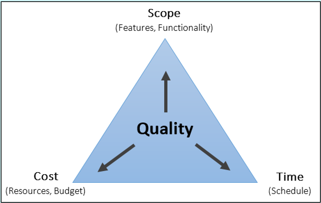
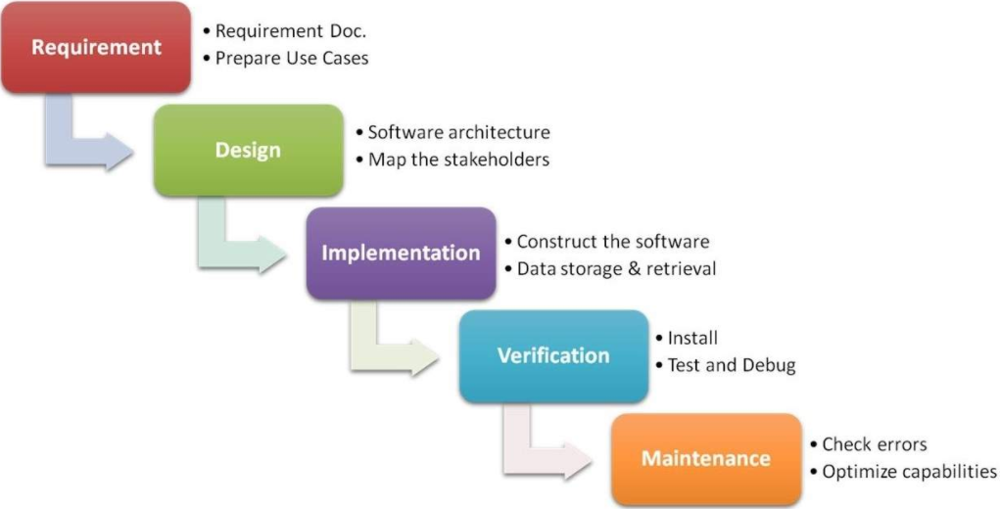
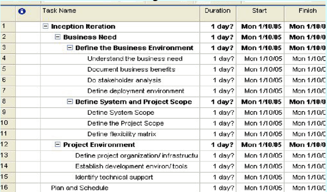
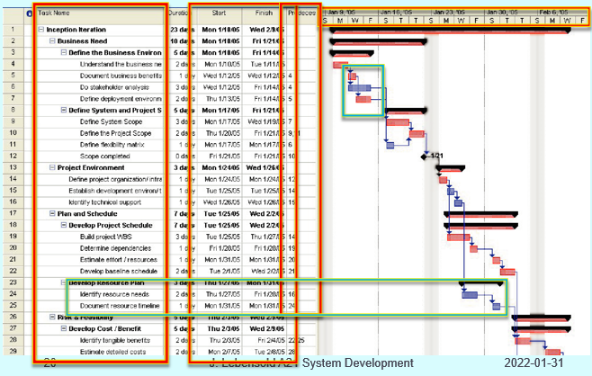

# Chapter 01
## *Project Management*
> Project management is the organizing and directing of people to achieve a planned result within a predetermined schedule and budget. 
The goal is to deliver a system that is acceptabe to clients and users, on time and within thee budget alloted.

 

## The Measurement of Project Success || The Quality Triangle
> Diagram by teacher

Successful systems must:
* Satisfy business requirements, their features and functionality and meet users’ needs
* Stay within budget, using the available resources
* Be completed on time

There are often tradeoffs -- You have to pick two out of three :
* Good and fast, but costly
* Fast and cheap, but lesser quality
* Cheap and Good, but takes more time

 

## Why Projects Fail
* Incomplete/Change in requirements
* Unclear requirements, targets or scope
* Limited user involvement
* Lack of executive support
* Lack of technical support
* Poor planning 
* Poor design choices
* Unclear objectives
* Unrealistic cost estimates
* Lack of required resources
* Poor monitoring and control of progress
* Inadequate reaction to early signs of problems
* Failure to recognize activity dependencies
* Personality conflicts and employee turnover
* Shortcuts or sloppy work
* Insufficient testing or test procedures
* Lack of software change control
* Changes in culture, funding, or objectives

 

## Participants in Development Projects
* Client/sponsor
    * The person or group who funds the project
* User or users 
    * The person or group who will actually use the new system
* Oversight committee (larger organizations)
    * Representatives of clients and management
    * Review and direct the project
    * Board of trustees for a company

 

## Elements of Project Management
| Element | Definition |
|---------|------------|
| Scope Management | - Defining and controlling the functions that are to be included in the system  - Scope of the work to be done by the project team |
| Time Management | - Building a detailed schedule of all project tasks  - Monitoring the progress of the project against defined milestones |
| Cost Management | - Calculating initial cost/benefit abalysis and later updates - Monitoring expenditures as the project progresses |
| Quality Management | - Establishing a total plan for ensuring quality - Includes quality control activities for every phase of the project |
| Human Resource Management | - Recruiting and hiring project team members - Training, motivating, team building to ensure a happy, productive team |
| Communications Management | - Identifying what and how to communicate to all stakeholders - Establish communications mechanisms and schedules |
| Risk Management | - Identifying and reviewing throughout the project all potential risks for failure - Developing plans to reduce these risks |
| Procurement Management | - Developing requests for proposals - Evaluating bids - Writing Contracts - Monitoring vendor performance |

 

## Project Manager
* Coordinates project development
* Creates a detailed plan at project inception &emsp; Activities that must take place &emsp; Deliverables that must be produced &emsp; Resources needed
* Accountable for success or failure
* Most large projects have one
* Project manager may or may not act as a "boss" &emsp; Shares authority with "architect"/"Technical lead" &emsp; Sometimes the project manager is really just in charge of the schedule

 

## Where do projects come from? 
* Business opportunity &emsp; I.e.: Restaurants needed to begin offering delivery when Covid19 shut down their dining rooms
* Long-term strategic plan (top-down)
* Department managers or process managers (bottom-up) &emsp; Individual workers will see ways in which the processes in the business can be improved

 

## Defining problems within projects
Begore undertaking any project, having a good understanding of what problem this new system will solve is important. To determine the scope of the project, the business problem needs to be precisely defined.
* Not enough customers
* Too many customers -- System won't be able to handle the influx
* Employees -- They might not be pulling their weight
* Business processes -- insufficience
* Developped list of expected business benefits -- reason the clients are funding the new system

 

## System and Project scope
Project Scope &emsp; **How** the project is to be built &emsp; Provides data conversion information &emsp; Sets parameters for quality control  System Scope &emsp; Defines capabilities of new system

 

## Project Planning
There are two methods used today when it comes to planning and executing IT projects:  &emsp; Waterfall and Agile

### Project Planning with Waterfall
> https://www.ukessays.com/essays/computer-science/waterfall-methodology-in-software-development.php  

Waterfall has well-defined, discrete stages of development. This method works best when the goals of the project are well known. The project is completed in stages and is moved step by step towards an ultimate release to consumers. You study the requirements at the outset, and then make a big plan upfront. This plan is then followed until the project terminates. This is a traditional engineering approach to problem solving. It works very well when the desired outcome is well understood at the outset.  These are the phases of Waterfall:  
* Requirements -- Product requirements document:
    * Analyze business neds
    * Document what software needs to do
* Design -- Software architecture: 
    * Choose the technology
    * Create diagrams
    * Plan software architecture
* Coding or Implementation -- Software:
    * Solve problems
    * Write code
* Verification and Testing: 
    * Ensure code does what it is supposed to do without breaking
* Operations and Maintenance:
    * Deploy code to a production envireonment
    * Provide IT support  

| Waterfall Advantages | Waterfall Disadvantages |
|----------------------|-------------------------|
| Extensive documentation from the beginning of the project | No going back &emsp;It is difficult and espensive to go back and make changes once an activity is finished |
| Organizational Knowledge &emsp;Knowledge stays in the organization; if someone leaves, the documentation is there and nothing is lost &emsp;No need to train new members as they can gain extensive knowledge of the project through documentation | No room for error during the requirement phase &emsp;Everything relies heavily on the requirements phase and if you make an error, the project is doomed |
| Better advance planning | Deadline Creep &emsp; Once an activity is late, all the activities are late including the project deadline |
| Easy to understand &emsp;Due to the project being worked on in distinctive stages, the project management is straightforward and understandable | QA is too late to be useful since testing is done at the end of the project; developers may not be able to improve how they write code |
| Client knows what to expect &emsp; Know in advance the cost and timeline of the project so they can plan their business activities and manage cash flow according to the plan | Bug Ridden Software due to testing being done at the end |
| Client input not required apart for occasional reviews, approvals and status meetings | Not What Client Usually Needs &emsp;If the client realizes they need more than they initially thought, the project plan will need a major overhaul including the budget |
| Easier to measure progress (Grantt chart) | Unexpected Problems |
| Better design &emsp;Higher cohesion during design phase |  |

 
How you actually plan with Waterfall:

1. Define clear, concrete activities and the work needed to complete each activity
2. Identify both activities (tasks) and events (milestones)
3. Set the schedule for each activity  &emsp; a. Develop the work breakdown structure (WBS) &emsp; b. Develop the schedule &emsp; c. Develop resource requirements and staffing plan

 

### Project Planning with Agile
For more exploratory projects, an overall plan cannot be developed, and so iterative processes are used, favoring what is called an “agile” approach. This approach is permissive to frequent

 

## WBS in MS Project
> Graph from Teacher 

There are four ways in which we can identify the WBS tasks:
* Top-down: Identify major activities first, like those in bold here
* Bottom-Up: List all tasks first and organize later, like the non-bold items here
* Template:  Use a standard template of tasks. Perhaps there is a template for the kind of project you are undertaking. For example, you can find WBS for planning a move.
* Analogy: If there is a similar completed project, you can copy the tasks from it.

 

## Project Scheduling
Project manager must know
* Duration / time needed for each task
* Order in which the tasks will be performed
* Dependencies (which tasks need to be done for another to begin)
* Start and end times for each activity
* Who will be assigned to each task
* Resource levelling (No overloading or under-utilizing team members) by readjusting schedule
* What other resources are needed and when 

## Grantt Chart
When this chart is done, you will be able to determine what is called the critical path. This is the sequence of activities that must be completed as scheduled in order that the project be one on time. The concept comes from noticing that there are activities that can be delayed without affecting the outcome. They have what is called slack time. If activities on the critical path is late, the entire project is late.

> Graph by Teacher  

A bar chart that illustrates a schedule &emsp;
Time is shown on the horizontal axis &emsp;
Activities (tasks) are on the vertical axis &emsp;
Easy to show to managers, programmers 
A task is shown as a bar &emsp;
Horizontal position shows task’s start, end dates &emsp;
Length of the bar shows the task’s duration 
The arrows show the relationship between each task and its predecessors &emsp;
Predecessors: the task(s) that must be (normally) finished before a certain task can begin

 

## Project Status Meetings
As the project moves forward, the project manager will schedule regular status meetings with the development team. During these meetings members of the development team will: 
* Share information
* Identify problems or delays
* Explain new techniques
* Offer comments to team members
* Conduct brainstorming sessions
* Encourage one another
