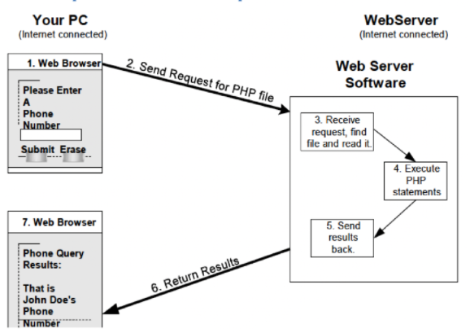

# Chapter 01
## *Introduction to PHP*
> This chapter focuses on understanding what PHP is and how it functions. It addresses what software and components are needed to begin learning PHP as well as review certain aspects about HTML.

## HTML
HTML is used to provide web browser output, but PHP scripts can output any information format.

<br>

## How PHP Scripts are Accessed and Interpreted
> Diagram by teacher<br>

<br>

## Getting Started with PHP
This is what is needed to develop and publish PHP scripts:
* Web server & PHP interpreter *or* a readymade solution (i.e.: XAMPP)
* Computer with a text editor

<br>

## Exploring the Basic PHP Development Process
Steps to publish and develop PHP:<br>&emsp;To publish online:<br>&emsp;&emsp; 1. Create a PHP script file and save it to a local disk<br>&emsp;&emsp;2. Use FTP to copy the file to the server<br>&emsp;&emsp;3. Access your file using a browser - through the server address -  *yourserver/path/filename*<br><br>&emsp;Testing on your local server:<br>&emsp;&emsp;1. Create a PHP script file and save it to the local server path<br>&emsp;&emsp;2. Ensure that your server is up and running<br>&emsp;&emsp; 3. Access your file using a browser, through server address - *IP/path/filename* **or** *localhost/path/filename*

<br>

## Local Disk
PHP scripts start with a ```<?php``` tag and ends with ```?>```. These scripts must be place in a folder that is under the server web root folder.

<br>

## What is PHP?
Hypertext Preprocessor (PHP) is an open source script language to be used within HTML document in order to develop applications and make them dynamic. It is executed on server side and  is used for various web applications such as messaging, blogging, online banking, etc.

<br>

### What can be done with PHP?
* Generate dynamic page content
* Create, open, read, write, delete & close files on server
* Collect form data
* Add, delete, modify data in database

<br>

### Static vs Dynamic website
| Static Website | Dynamic Website |
|----------------|-----------------|
| Directly written using HTML<br>&emsp; Can have Javascript added to look dynamic<br>&emsp;&emsp;Only executed on client-side | PHP is used server-side for heavier treatments requesting database access, complex searches, etc |
|  | Does not rely on user's computer or software speed<br>&emsp;Processing of documents are more efficient |
|  | Scripts are interpreted and executed on server<br>&emsp; Clients recieves results in form of a simple HTML document |
|  | Using PHP rapidly and easily creates dunamic web documents<br>&emsp; MySql is great for conjunction |

<br>

### PHP Files
* Can contain:
    * HTML
    * CSS
    * JavaScript
* Executed on the server, result is returned to the browser
* Has ".php" extension

<br>

## Variables in PHP
Variables are “containers” for storing
some kind of information, in PHP there is no command to create them, they are created the moment there is a value assigned to it.

<br>

## HTTP GET and POST method article
> https://www.geeksforgeeks.org/http-get-post-methods-php/

<br>

### What is HTTP?
The Hypertext Transfer Protocol (HTTP) is designed to enable communications between clients and servers. It works as a request and response protocol between a client and server. The response contains status information about the request and may also contain the requested content.
* GET: Requests data from a specified resiyrce
* POST: Submits data to be processed to a specified resource

<br>

### GET Method
The data is sent as URL parameters (usually string of name and value pairs separated by &)
```PHP
$lastName = $_GET["LastName"];
```
<br>

### POST Method
The data is sent to the server as a package in a separate communication with processing script. Not visible in URL.
```PHP
$firstName = $_POST["FirstName"]
```